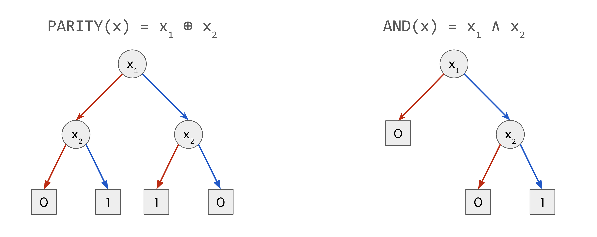

* TOC
{:toc}

In this lecture we will formalize definitions in query complexity of Boolean
functions (see the
[survey](https://www.sciencedirect.com/science/article/pii/S030439750100144X)
by Burhman and de Wolf). Our hope is that this will serve as a motivation for
the kind of projects related to TCS that can be taken up in the course.

The main component of the lecture is covered in the [demo]({{page.demo_url}}).
We will walk through this in the class, and fill in the gaps in the definitions
and theorems there. The completed Lean source will be added here after the
lecture.

In these lecture notes, we first touch upon additional key concepts in Lean not
already covered that will be relevant for the demo. And then, we cover the
relevant background on query complexity of Boolean functions as required for
the demo.

## 1. Code Organization & Scope Management

We cover some common conventions for organizing code and managing scopes of
variables.

### variable

We can abstract away common arguments to `def` and `theorem` using `variable`.

For example, if we have `(x : Nat) (h : x > 0)` as binder for a sequence of
`theorem`s, then we can define it once using `variable` and it gets introduced
for each `theorem` in the group.

Note: Lean automatically inserts the variable as an argument *only* if the
definition actually uses it.

```lean
variable (α : Type) 

def myId (a : α) : α := a

#check myId   -- Output: myId (α : Type) (a : α) : α
```

### namespace
`namespace` allows logical grouping with name prefixing.

This allows us to avoid name collisions (e.g., distinguishing `Nat.add` from
`Int.add`), by automatically prepending the namespace name to every definition
inside.

**Note:** Variables/definitions created inside remain associated with that namespace.

```lean
namespace MySpace

  -- Full name: MySpace.foo
  def foo : Nat := 10

  -- Full name: MySpace.bar
  -- Can call 'foo' directly here because we are inside the namespace
  def bar : Nat := foo + 5

end MySpace

-- Outside, must use full name
#check MySpace.foo
```

### section

`section` allows limiting the scope of `variable` commands (and also `open`
commands, discussed next). But crucially, unlike `namespace`, it does **not**
change the name of definitions. So `section` is useful for setting up common
parameters (hypotheses) for a block of theorems, and then discarding them.

**Syntax:**

```lean
section MySection

  variable (n : Nat) -- 'n' is now an argument for everything in this section

  def double : Nat := n + n 

end MySection
-- 'n' is no longer a set variable here

#check double  -- Name is just 'double', NOT 'MySection.double'
```

### open

`open` allows for accessing names without the namespace prefixes. In the above
example, this allows writing `foo` instead of `MySpace.foo`.

Once `open` is applied, it applies to the current "block", that is, until the
end of `namespace` or `section`, or simply end of file.

`open` can be applied in three variants:

**Standard `open`**:
Opens for the remainder of the current scope.

```lean
open List
#check map  -- Works (refers to List.map)
```

**Scoped `open` (inside Section)**:
Demonstrates how `section` acts as a container for `open`.

```lean
section
  open List
  -- 'map' works here (refers to List.map)
end
-- 'map' no longer works here; the section closed the scope.
```

**Inline `open ... in`**:
Opens a namespace *only* for the execution of the immediately following command.

```lean
-- Opens 'List' just for this definition
open List in
def myFunc : List Nat := map (· + 1) [1, 2, 3]
```

## 2. (Finite) Subsets and Subtypes

In Lean, every element has a unique type. So if we want to index over natural numbers in $\\{0, \ldots, n-1\\}$, then we would need to create a new type for it.

Such a type can be created as `{x : Nat // x < 5}`. More generally subtypes of `α` can be created as `{ x : α // p x}` (or simply `{ x // p x}`, since the type of `x` can be inferred).

An element of a subtype is a structure with a value (`val`) and a proof (`property`) that `val` satisfies the said property.

```lean
def x : {z : ℕ // z < 5} := ⟨3, by simp⟩

-- You access the value using .val or .1, or prefixing by ↑.
#check x.val -- This is a Nat (3)
#check x.property -- This is a proof (3 < 5)
#eval ↑x          -- Same as x.val
```

A subtype is distinct from a set, which would be defined as `{x : Nat | x < 5}`.

Notes will be added on `Fin`, `Finset` and `Fintype` shortly.

## 3. Query Complexity of Boolean Functions

We consider two complexity measures of Boolean functions
$f : \\{0, 1\\}^n \to \\{0, 1\\}$.

### Decision Tree Complexity

A decision tree is a binary tree where every internal node is labeled with an
index $i \in [n]$ and every leaf is labeled with a value in $\\{0, 1\\}$.

A decision tree evaluates an input $x \in \\{0, 1\\}^n$ by starting at the root,
and recursively querying the variable at the index specified by the node. If the
variable is $0$, the algorithm moves to the left branch, and if the variable is
$1$, it moves to the right branch. Once at a leaf, the corresponding value is
returned.

Below are examples of decision trees that compute the two bit Parity function
and the two-bit And function.

{: style="display:block; margin-left:auto; margin-right:auto; width:80%"}

For any Boolean function $f : \\{0, 1\\}^n \to \\{0, 1\\}$, its decision tree
complexity $D(f)$ is the smallest depth of a decision tree that computes $f$.

### Sensitivity

The sensitivity of a Boolean function $f : \\{0, 1\\}^n \to \\{0, 1\\}$ at
input $x \\in \\{0, 1 \\}^n$ is
$s(f, x) := |\\{ i : f(x) \ne f(x^{\oplus i})\\}|$, the number of coordinates of
$x$ that when flipped, change the value of the function $f$.

The sensitivity of $f$ is $s(f) := \\max_{x \in \\{0, 1\\}^n} \ s(f, x)$.

### Theorem: Sensitivity ≤ Decision Tree Complexity

The main theorem we will work through in this lecture is the following:

**Theorem.** For all $f : \\{0, 1\\}^n \to \\{0, 1\\}$ : $s(f) \leq D(f)$.

**Proof Sketch.**
Consider a decision tree $T$ that computes $f$. On any input
$x \\in \\{0, 1\\}^n$, if the decision tree $T$ does not query a sensitive bit
$i \in [n]$ of $x$, then it might compute either $f(x)$ or $f(x^{\oplus i})$
incorrectly.\
$\square$

See [demo]({{page.demo_url}}) for the Lean file to work through these
definitions and proofs.

### Further Topics

Query Complexity of Boolean functions is a rich research topic. There are numerous other complexity measures of which we name a few:
* Randomized Query Complexity (Bounded-error, Unbounded-error, One-sided error, Zero error)
* Quantum Query Complexity
* Block sensitivity
* Degree, Approximate degree, Threshold degree, Rational degree

New breakthroughs continue to happen even in the last few years, some notable examples being the proof of the [Sensitivity Conjecture](https://arxiv.org/abs/1907.00847), and a more recently the [Rational Degree Conjecture](https://arxiv.org/abs/2601.08727).

Formalizing old / new results in this area could be a ripe topic for course projects!